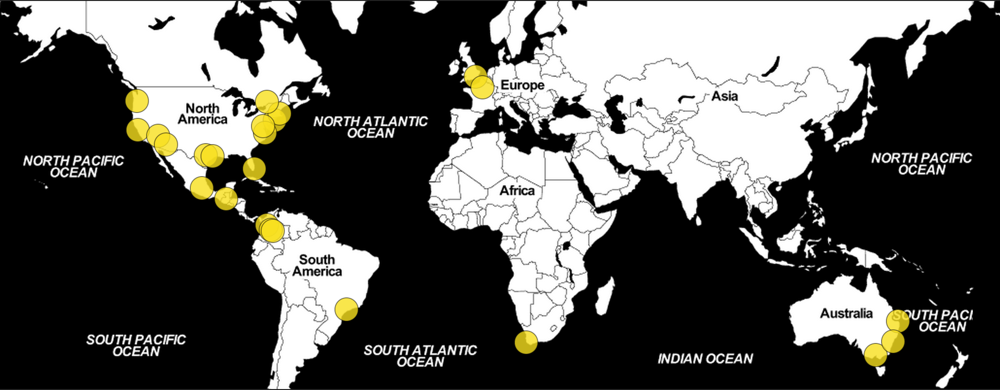

# WELCOME TO THE FIRST
# INTERNATIONAL NODEBOTS DAY

---

# this time around...

# It's a BIG DEAL!

---

# Schedule

| Time          | What's Happening  |
|---------------|-------------------|
| 10:00 - 10:15 | Registration / welcome |
| 10:15 - 10:30 | What are NodeBots, electronics for JS developers etc |
| 10:30 - 12:00 | First session - getting you up and running, playing with ARDX Kits, building simplebots |
| 12:00 - 13:00 | Lunch |
| 13:00 - 15:30 | More hacking, unconference sessions including some WebRTC goodness :) |
| 15:30 - 16:00 | SoccerBot / SumoBot competitions |
| 16:00 - 16:45 | Show and tell of your things and "People's choice Awards!" |
| 16:45 - 17:00 | Finish up, pack up gear etc. |

---

# WebRTC in the mix

- We've joined forces with some regular WebRTC hackers to see what more we can do to free our bots from wires!
- If you want to learn more about WebRTC then join in the unconference sessions later.

---

# Unconference

- Feel free to suggest a topic
- Feel free to share what you know about something
- We'll be gathering topics on a whiteboard here

---

# Thanks To:

## NICTA

- For hosting us here (including Wifi + Coffee)
- Providing the ED1 boards to hack on

## Prize Sponsors

- Intel
- LIFX

## People

- First and foremost, you should tweet your thanks to [@ajfisher](https://twitter.com/ajfisher) as he coordinated this wonderfully between the states and help us get our hardware sorted as well as Melbourne!

- Our mentors today, as well as anyone else who helps out anyone who get's stuck!

- People helping the day generally run smoothly!

---

# GO FORTH AND BUILD!

